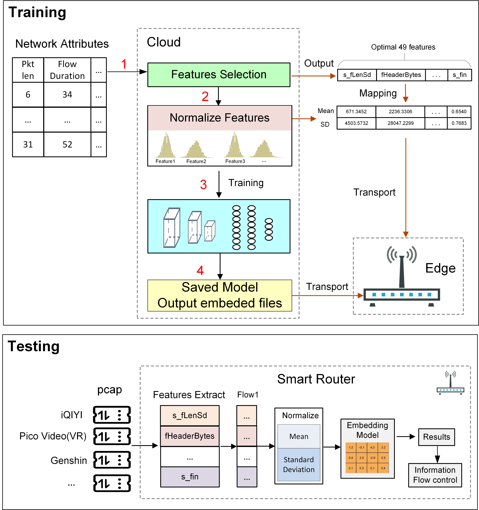

# FlowAutoML
<p align="center">
  <a href="#-introduction">🎉Introduction</a> •
  <a href="#-model">🦜Model</a> •
  <a href="#-How to use it?">📍How to use it?</a> •
   <a href="#-datasets">🌟Datasets</a> •
  <a href="#-acknowledgement">👨‍🏫Acknowledgement</a> •  
  <a href="#-contact">🤗Contact</a>
</p>

## 🎉 Introduction
The AI-based network traffic classification technology has played a vital role in Zero-touch network and Service Management (ZSM). Network Traffic Features are the critical input for AI-based network traffic classification. However, unlike images and natural language traffic, features have high dispersion and weak stability. On the one hand, part of the key numerical flow features have a wide range of values. By scaling the features, the model can be better trained, which allows the classifier to make more accurate predictions. On the other hand, edge networks cannot scale features as well as the training set in the cloud. This situation affects the model’s performance on edge devices. This paper proposes a novel processing method of flow features for the AI-based network traffic classification model using cloud-edge collaboration. The method leverages the strong computational power of cloud computing to scale the flow features and transmit parameters derived from feature scaling to edge networks. The edge network processes the real-time flow through parameters, significantly enhancing the devices’ accuracy. To validate its effectiveness, we conducted four experiments, comparing models trained with and without feature scaling. The experimental results demonstrate that the model trained with feature scaling outperforms the model trained without scaling.

## 🦜Model
<div align="center">
  
</div>

## 📍How to use it?

The model is divided into two parts: 1. Training; 2. Embedding.

We firstly run `train.py` to obtain `model.h5` and log of `features`. 

When you finish training, you can change the parameter `--isInitialization` to `no`. Next, the saved model can be converted into `.c` and `.h` to realize embedded development.
`MODEL_FILE` is saved model file path. `Test_Example` is data set. `Feature_List`is features log path.

## 🌟Datasets
[njupt2023](https://github.com/NJUPTSecurityAI/total-papers-summary/blob/main/njupt2023.csv),
[MIRAGE-2019](https://traffic.comics.unina.it/mirage/mirage-2019.html),
[CIC-IDS](https://www.unb.ca/cic/datasets/vpn.html)

## 👨‍🏫 Acknowledgement
Citation
If you find this useful in your research, please consider citing:
```
@INPROCEEDINGS{10538990,
  author={Li, Zeyi and Zhang, Ze and Fu, Mengyi and Wang, Pan},
  booktitle={2023 IEEE 22nd International Conference on Trust, Security and Privacy in Computing and Communications (TrustCom)}, 
  title={A novel network flow feature scaling method based on cloud-edge collaboration}, 
  year={2023},
  volume={},
  number={},
  pages={1947-1953},
  keywords={Training;Cloud computing;Privacy;Computational modeling;Collaboration;Telecommunication traffic;Stability analysis;Feature Engineering;Feature Scaling;Traffic Classification;Deep Learning;Zero-touch network},
  doi={10.1109/TrustCom60117.2023.00265}}
```
We reused the code from this repository：[EmbedIA](https://github.com/Embed-ML/EmbedIA).

## 🚀 Star History

[](https://star-history.com/#AIDC-AI/Parrot&Date)

## 🤗Contact
If there are any questions, please feel free to propose new features by opening an issue or contacting the author: 2022040506@njupt.edu.cn
